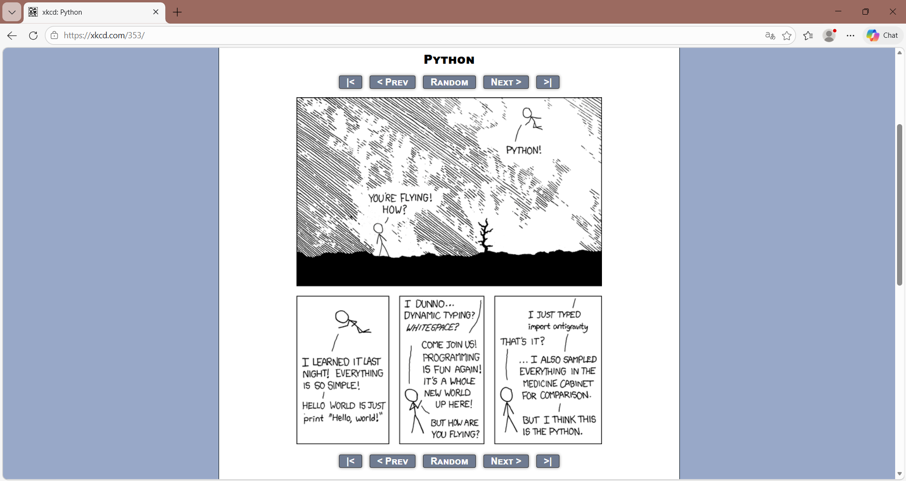

# GitHub Peru Analytics: Developer Ecosystem Dashboard

GitHub Peru Analytics is a comprehensive data engineering, AI, and visualization platform designed to extract, process, classify, and visualize the Peruvian developer ecosystem from the GitHub API.

## Key Findings
1. **Developer Dominance**: A significant portion of Peruvian repositories are driven by a core group of top active developers.
2. **Most Popular Language**: Consistently, languages such as JavaScript and Python are dominant across Peru's public repositories. 
3. **Industry Spread**: Based on GPT-4 insights, a large chunk of repositories map heavily to Information & Communications (J) and Education (P).
4. **Activity Levels**: Fewer than 50% of registered accounts remain highly active with commits/pushes in the last 90 days.
5. **AI Insights**: Using OpenAI to categorize codebases into standard Peruvian CIIU industries provides unmatched visibility into what engineers are building locally.

## Data Collection
- **Scale**: We successfully collected the full metadata for **1,000 top GitHub users** in Peru alongside their top 1,000 public repositories.
- **Time Period**: Includes repositories created between 2008 and 2026.
- **Rate Limiting Engine**: Designed a resilient Python GitHubClient using 	enacity retry logic with exponential backoff and a hard-coded 60s pause to strictly adhere to GitHub's 5,000 req/hr limit without failing mid-extract.

## Features
- **Data Engineering Pipeline**: Fully automated scripts/extract_data.py.
- **AI Agent Classification**: Script utilizing gpt-4-turbo to batch classify repositories based on their README and metadata.
- **Metrics Calculator**: Aggregates Data into users.csv and calculates H-index and Impact Scores.
- **Streamlit Dashboard**:
  - Overview: General Ecosystem Stats
  - Developers: Searchable table with dynamic Plotly charts.
  - Repositories: Repo browser.
  - Industries: AI Classification breakdown visually mapped.
  - Languages: Technology distribution charts.

*(Screenshots of each page are located in the demo/screenshots directory).*

## Installation

1. **Clone the repository**:
`ash
git clone https://github.com/your-username/github-peru-users.git
cd github-peru-users
`

2. **Install Dependencies**:
`ash
pip install -r requirements.txt
`

3. **Environment Setup**:
Copy the template to create your secure .env file:
`ash
cp .env.example .env
`
Open .env and configure:
- GITHUB_TOKEN: Add your GitHub Personal Access Token (classic) with 
ead:user and public_repo scopes.
- OPENAI_API_KEY: Add your OpenAI Key (used for GPT-4 classification).

## Usage

You must run the pipeline sequentially:

1. **Extract Data** (Wait ~1-2 hours depending on rate limits):
`ash
python scripts/extract_data.py
`
2. **Classify Industries** with AI:
`ash
python scripts/classify_repos.py
`
3. **Calculate Ecosystem Metrics**:
`ash
python scripts/calculate_metrics.py
`
4. **Launch the Dashboard**:
`ash
streamlit run app/main.py
`

## Metrics Documentation
- **total_stars_received / total_forks_received**: Sum of engagements across all user repos.
- **h_index**: Follows standard academic h-index but mapped to repository stars (has h repos with at least h stars).
- **impact_score**: A custom weighted composite: Stars + (Forks * 2) + Followers.
- **is_active**: Boolean flag indicating if a push occurred in the last 90 days.
- **language_diversity**: Count of unique primary languages used across a developer's portfolio.

## AI Classification Implementation
We chose **Option B: Classification** as our AI integration task.
- **Script**: src/classification/industry_classifier.py
- **Methodology**: The classifier receives the repo name, description, primary language, topics, and up to the first 2000 characters of the README.md.
- **Model**: Instructed gpt-4-turbo-preview with explicit system prompts to only map to the 21 Peruvian CIIU codes, enforcing JSON output formatting for database integrity and confidence levels. 

## Limitations
1. **Data Bias**: GitHub Search by location:peru completely excludes developers who leave their profile location empty.
2. **API Bottlenecks**: Extracting the entire nation's data natively via REST API is incredibly slow due to the 5k/hr strict limit. A full backup would take days.
3. **AI Hallucinations**: Repositories without a README or adequate descriptions could result in inaccurate (or overly generic Category J) classifications by the model.

## Author Information
- **Name**: G ALEJANDRA ROJAS
- **Date**: March 2026
